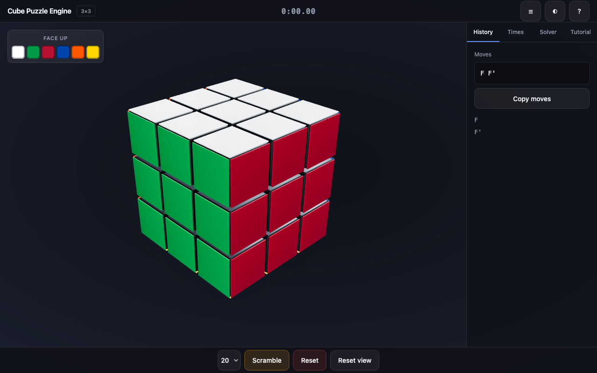
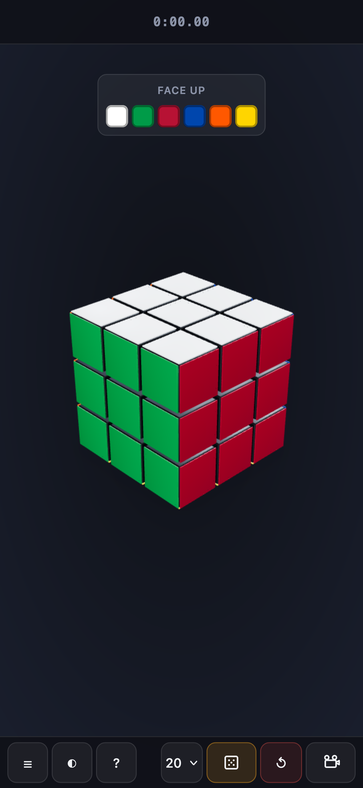

# Cube Puzzle Engine

Interactive 3×3 Rubik's cube built with TypeScript, React, React Three Fiber, and Zustand.

## Screenshots

**Desktop** — default U–F–R inspection angle at 38° FOV with studio lighting.



**Mobile** — compact layout with bottom-sheet controls.



## Features

- Animated face and slice moves with drag-to-turn and keyboard input
- WCA-accurate sticker colors and speedcubing notation
- Scramble, undo, move history, and reset controls
- Portfolio-quality 3D presentation with PBR materials, contact shadows, and tuned lighting
- Keyboard-first accessibility with screen reader move announcements

## Quick start

```bash
npm install
npm run dev
```

Open the local URL shown in the terminal.

## Controls

See [docs/CONTROLS.md](docs/CONTROLS.md) for the full reference.

| Action | Input |
|--------|-------|
| Turn face | Drag a sticker |
| Orbit | Drag background |
| Face move | `R L U D F B` |
| Prime | `Shift` + face |
| Half turn | `2` then face |
| Scramble | `X` or toolbar |
| Undo | `Ctrl+Z` |
| Help | `?` |

## Accessibility

- Keyboard shortcuts cover all primary puzzle actions.
- Press `?` in-app for the shortcut list.
- `prefers-reduced-motion` disables idle float and shortens animations.

## Architecture

| Layer | Responsibility |
|-------|----------------|
| `domain/` | Pure cube logic — moves, scramble, notation |
| `state/` | Zustand orchestration — cube, animation, UI |
| `render/` | R3F visualization |
| `ui/` | DOM chrome — panels, toolbar, onboarding |
| `solver/` | Solver stub (future) |

## Scripts

```bash
npm run dev      # development server
npm run build    # production build
npm run test     # unit tests
npm run lint     # ESLint
```
